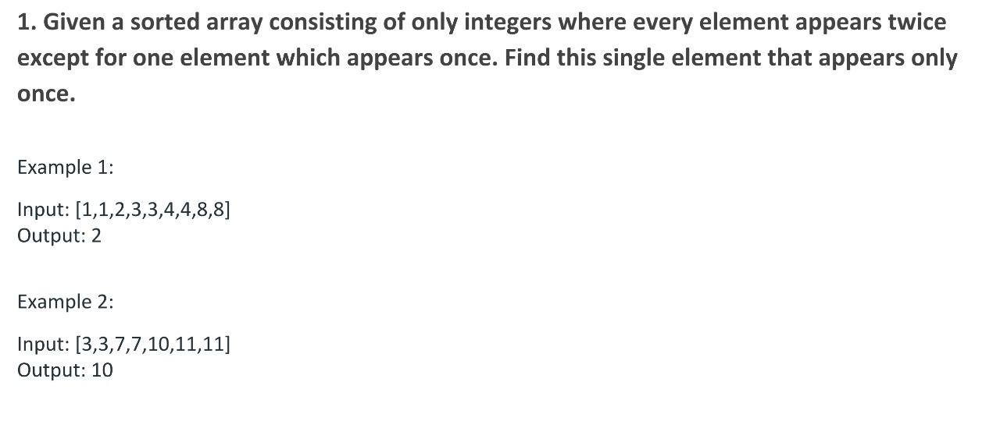
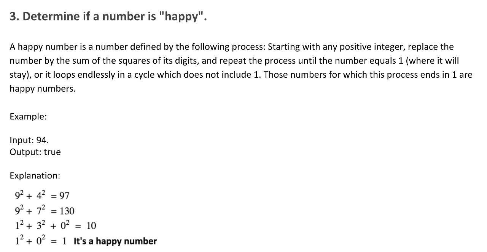
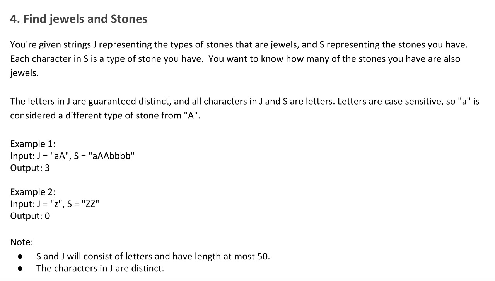

# Rigo Challenges

## Week 1
All the solutions for the challenges have been written using Java language and Eclipse IDE.

### Challenges
1. [**Pair Elements**](Pair%20Elements/)
  
  #### Video
  
2. [**Happy Numbers**](Happy%20numbers/)
  
  #### Video
  
3. [**Jewels and Stones**](Jewels%20and%20stones/)
  
  #### Video
  
  

